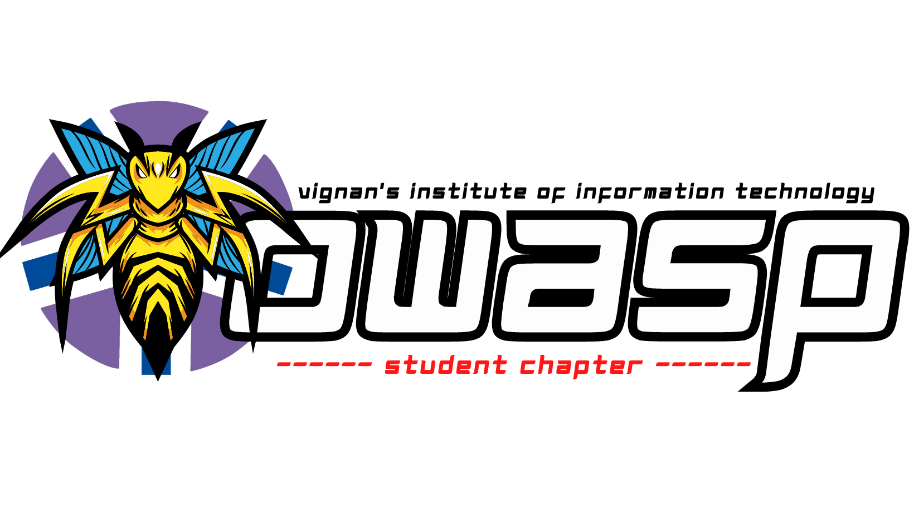

## Welcome

Vignan Institute of Information and Technology (VIIT) has been a steady source of highly skilled talent to the nation as well as overseas. A pioneer in engineering education, research and innovation. The team of OWASP Student Chapter, one of the gilt-edged coding society, involves ingenious mind solvers who are eager to make the world a better place to live in with their innovative techniques and discoveries. By successfully organizing many hackathons, tech-talks, workshops and coding nights, we have always strived hard to maintain the coding culture throughout the campus.

## Participation

The Open Web Application Security Project (OWASP) is a nonprofit foundation that works to improve the security of software. All of our projects ,tools, documents, forums, and chapters are free and open to anyone interested in improving application security.

Chapters are led by local leaders in accordance with the Chapters Policy. Financial contributions should only be made online using the authorized online donation button.

Everyone is welcome and encouraged to participate in our Projects, Local Chapters, Events, Online Groups, and Community Slack Channel. We especially encourage diversity in all our initiatives. OWASP is a fantastic place to learn about application security, to network, and even to build your reputation as an expert. We also encourage you to be become a member or consider a donation to support our ongoing work.

## Next Meeting/Event <!-- You should keep this section as it will populate your meetup events -->

### Upcoming Events

We Have Lots Of Exciting Stuff Coming Up Very Soon ! Stay Tuned To Our Media Channels ... :)

## Activities

We majorly indulge in sharing our knowledge through our blogs (both on Medium as well as on Blogger) and CTFs, spreading cybersecurity awareness with our weekly news, infographics, quiz, and instagram reels, conduct various events like CTFs, hackathons, webinars, workshops, open-quiz, along with various other cybersecurity events and most importantly learn together and contribute to the open-source community with our projects.

## Where we've come

Our organization stands with a Chapter Leader, Chapter Manager, Secretary and the sub-ordinating heads of various departments (Technical, Web-development, Design, and Operations). Each member is assigned certain roles and they regularly contribute for the development and growth of the chapter. Together, we work together to come together to fulfil our primary purpose - to spread awareness about cyber security.

## CONNECT WITH US!

Follow and Support us on

<a href="https://www.instagram.com/owasp.viit" target="_blank" > Instagram  </a>  
<a href="https://github.com/OWASP-VIIT" target="_blank" >   Github </a>  
<a href="https://twitter.com" target="_blank" >   Twitter </a>  
<a href="https://www.linkedin.com/in/owasp-aids-student-chapter-056b80244/" target="_blank" >   Linkedin </a>  
<a href="https://www.youtube.com" target="_blank" >   YouTube </a>  
<a href="https://www.facebook.com" target="_blank" >   Facebook </a>  

#### Stay Updated, Stay Safe!

#### ~ OWASP VIIT
